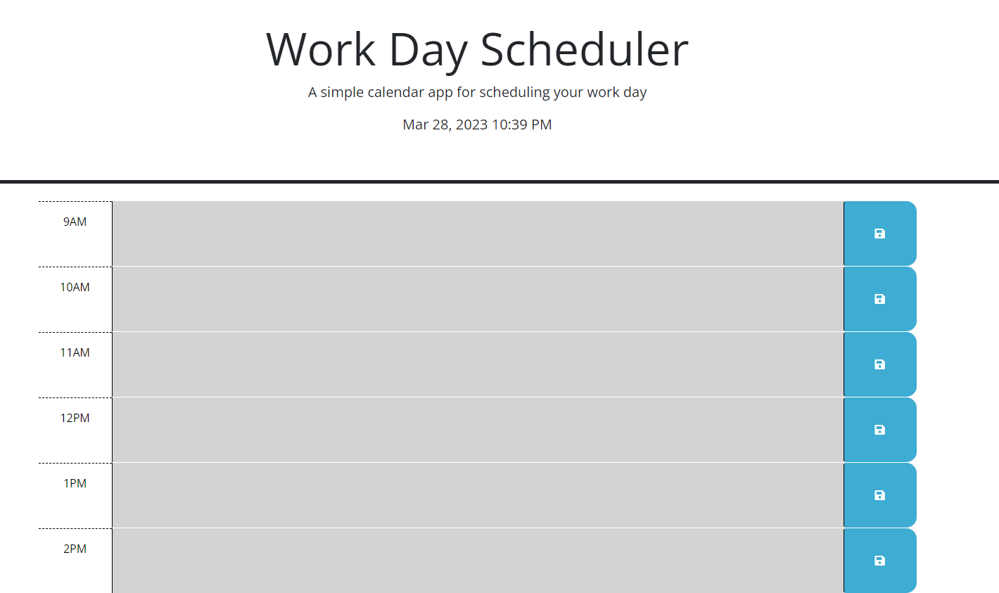

# HW-Challenge-5-Scheduler

## Description

Our objective this assignment was to update a work day scheduler using to meet the given criteria.

Main Objectives: 

- display current day at the top of the page
- present user with hourly time blocks that can hold text
- the color of the time blocks changes depending on whether the hour is in the past, present or future
- the user can save anything entered on the page in local storage so that when the page is refreshed the entered text remains

## Links

Application: 

Repo: https://github.com/pg1219/HW-Challenge-5-Scheduler

## Mock-Up

Preview image of deployed application

